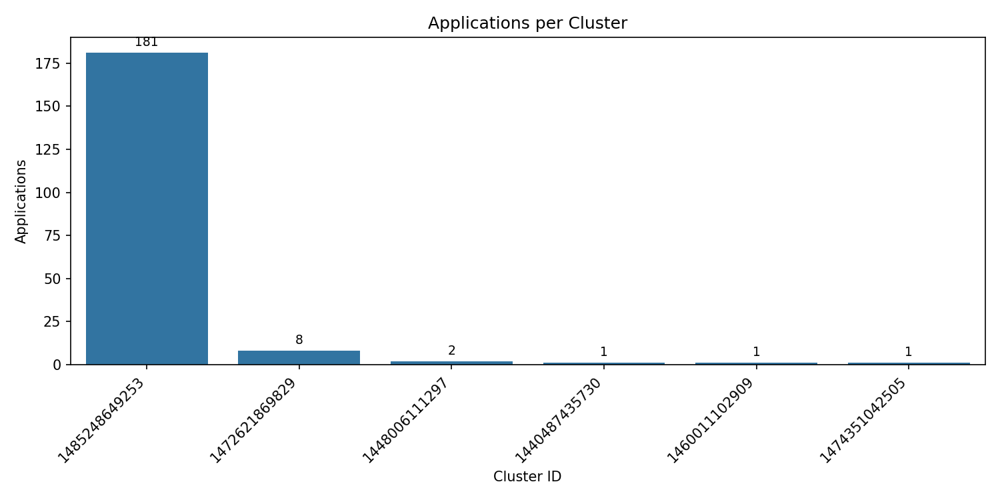
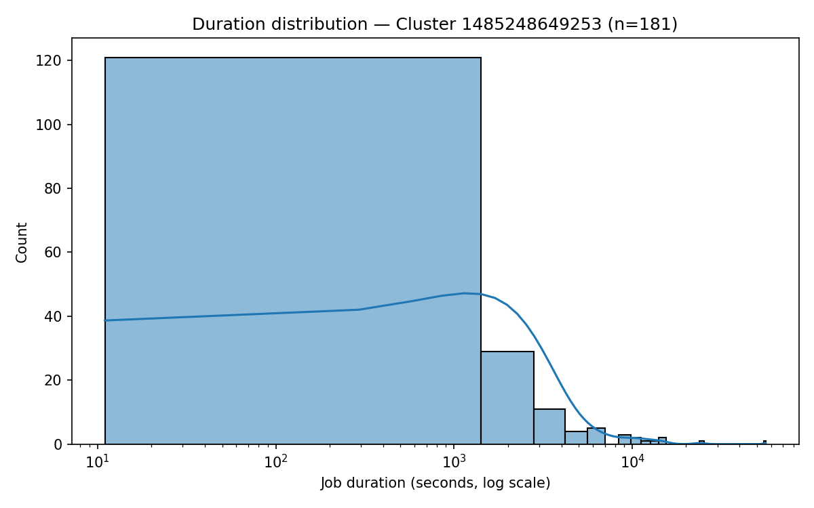
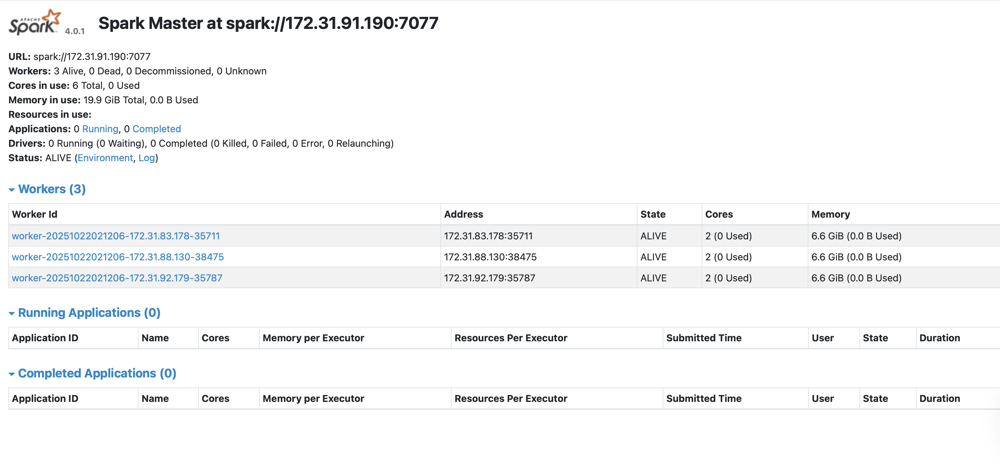
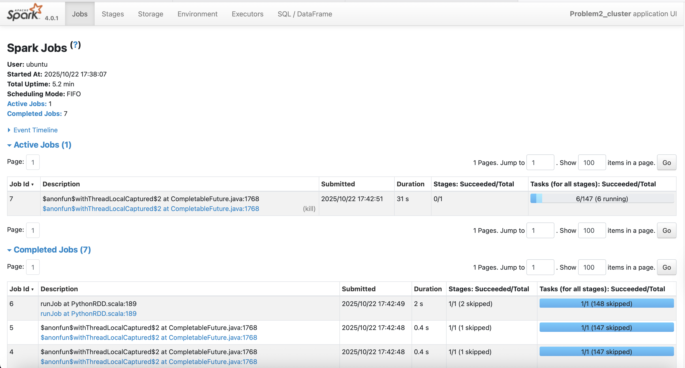

# A06 Spark Cluster Log Analysis

## 1. Problem 1 – Application Timeline Extraction

### Approach
Parsed Spark container logs from  
`s3a://ys1079-assignment-spark-cluster-logs/data/application_*/container_*.log`  
to reconstruct per-application start and end times.

Steps:
1. Extracted `application_id`, `cluster_id`, and `app_number` from file paths.  
2. Parsed ISO (`YYYY-MM-DD HH:MM:SS`) and legacy (`YY/MM/DD HH:MM:SS`) timestamps with `try_to_timestamp`.  
3. Computed each application’s start (`min(ts)`) and end (`max(ts)`) time.  
4. Saved results as a single CSV for further analysis.

### Findings
- Processed **~33 million** log lines:contentReference[oaicite:2]{index=2}.  
- 99.9 % were INFO, 0.04 % WARN, 0.00 % ERROR — indicating clean job execution.  
- Extracted valid timestamps for nearly all applications, confirming robust parsing.

### Performance
- **3 workers × 2 cores (6 total)**, ~12 GiB memory.  
- Runtime about 4–5 min per run.  
- Adaptive query execution and coalesced output improved I/O efficiency.

## 2. Problem 2 – Cluster Usage & Visualization

### Approach
Built on Problem 1 outputs to:
- Aggregate per-cluster metrics (`num_applications`, `first_app`, `last_app`).  
- Compute job durations and generate summary plots from Pandas.

### Results
From `problem2_stats.txt`:

| Metric | Value |
|--------|--------|
| Unique clusters | **6** |
| Total applications | **194** |
| Avg apps per cluster | **32.3** |

**Top clusters:**
| Cluster ID | Apps |
|-------------|------|
| 1485248649253 | 181 |
| 1472621869829 | 8 |
| Others | ≤ 2 |

A single cluster handled > 90 % of all applications.

- The total execution time is about 20 minutes using uv run python ~/problem2.py spark://$MASTER_PRIVATE_IP:7077 --net-id ys1079
- The execution time of running skipping spark cluster is about 2 minutes to generate the required png pictures. The command query is  uv run python ~/problem2.py --skip-spark, when running in spark-cluster

### Visualizations

#### Applications per Cluster

- Shows extreme workload imbalance — one cluster dominates usage.

#### Duration Distribution (Cluster 1485248649253)

- Most jobs finish within 10–1000 s; a few long-tail outliers exceed 10 000 s.

### Performance
- Runtime ≈ 5–6 min per job.  
- 7 completed jobs, 0 failures (verified in Spark UI).  
- Arrow + adaptive partitioning improved conversion and write speed.

## 3. Conclusions
- **Problem 1:** Successfully parsed and timestamped millions of log lines.  
- **Problem 2:** Quantified strong cluster imbalance and variable job durations.  
- **System:** Stable, no failed tasks; analysis scaled efficiently on 6 cores.  
- **Insight:** Future load-balancing or dynamic allocation could improve resource utilization.

### Spark Web UI Evidence

## Screenshots of Master UI

## Screenshots of Application UI
